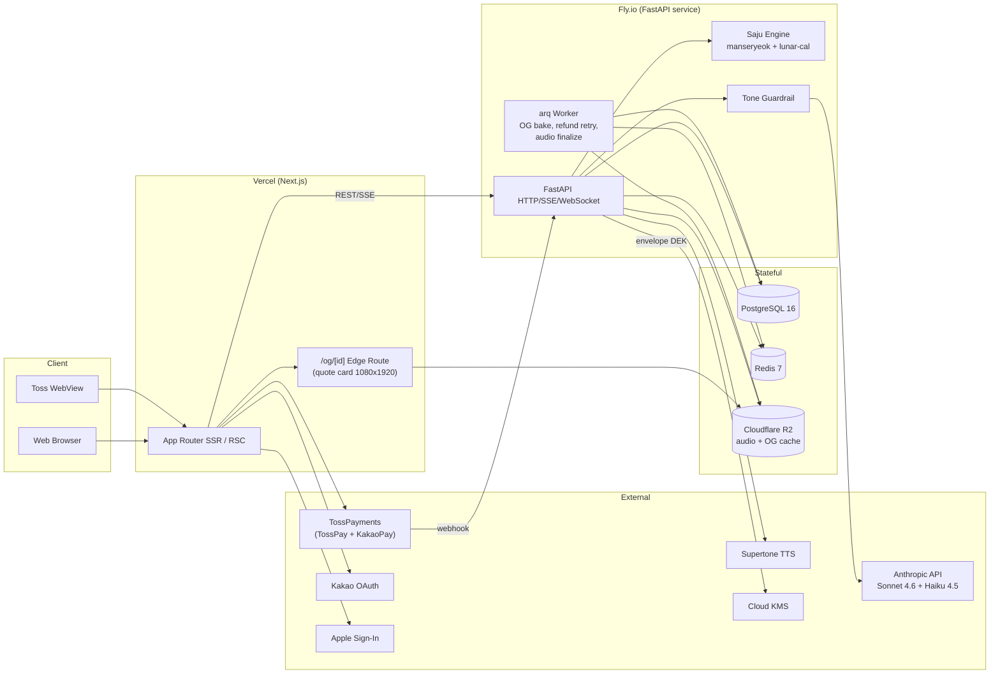

# Architecture — VoiceSaju

Version: 1.0
Source documents: `PRD.md`, `docs/prd_digest.md`, `docs/requirements.md`, `docs/brainstorm_notes.md`, `docs/business_analysis.md`
Architect confidence: **High** for stack/module choice; **Medium** for cost ceiling enforcement (Supertone pricing uncontracted — DEP-01).

> Companion docs:
> - Data model (entity-relationship + encryption envelope): handled later by data-modeler agent.
> - UX-driven API refinements: handled later once `docs/ux_spec.md` is ready.

---

## 1. Overview

### 1.1 Architecture Style — Modular Monolith (web frontend + backend split)

- **Frontend**: Next.js 15 (App Router, TypeScript) — single codebase serves Web and Toss WebView, with context-based capability adaptation.
- **Backend**: Python 3.11+ + FastAPI — single deployable service organised as internal modules (auth, saju engine, reading pipeline, tarot, payment, content, observability).
- **Datastore**: Postgres 16 (primary) + Redis 7 (session, rate limit, deterministic seed cache, idempotency keys).
- **Async work**: in-process FastAPI background tasks + a single lightweight worker process (RQ or arq on Redis) for fire-and-forget jobs (OG image generation, refund retries).

### 1.2 Why this style

- v1 has **one team, one cohesive product, one trust boundary**. Microservices would multiply ops surface (deploy, monitoring, IPC) without solving any current bottleneck.
- The expensive bits (LLM, TTS) are **external APIs**, not internal services. The "scaling unit" we actually have to size is the streaming pipeline, which is a single Python service.
- Reversibility: a modular monolith can be peeled into services later (saju engine, payment) if scale demands; the reverse is painful.
- NFR-001/002/003/004 (low-latency streaming) are easier to hit with one in-process pipeline than with hop-rich microservices.

### 1.3 Key constraints driving the design

| Constraint | Architectural implication |
|------------|--------------------------|
| NFR-001 reading start ≤ 3s p95 | LLM streaming + TTS streaming chunks; no batch synthesis. |
| NFR-002 TTS first chunk ≤ 1.5s | Direct Supertone WebSocket/HTTP streaming, server proxies to client over SSE/audio stream. |
| NFR-007 cost ≤ 20% of single price | Hybrid Sonnet 4.6 (main) + Haiku 4.5 (intro/tarot/follow-up); strict token budgets enforced at prompt level. |
| NFR-005 AES-256 column encryption | Application-level envelope encryption (KMS-backed DEK) for `birth_datetime` columns. |
| NFR-017 saju determinism | Pure-function engine wrapped around `manseryeok` + `korean-lunar-calendar`; cache by hash. |
| FR-013 deterministic daily tarot | Stateless SHA256 derivation; Redis cache only for performance, not correctness. |
| Toss WebView vs Web | Frontend reads runtime context flag and gates payment options + share sheet UIs; backend exposes same API. |

---

## 2. Tech Stack

| Layer | Choice | Version target | Why this, vs alternatives |
|-------|--------|---------------|----------------------------|
| Frontend framework | Next.js (App Router, TypeScript, RSC) | **15.x** (pinned to latest LTS-equivalent) | Single codebase Web + Toss WebView (PRD §3.2). SSR/RSC needed for OG meta + share URL preview (FR-020). Vercel-native deploy. Alternative rejected: SPA-only (Vite/React) — loses SSR-driven OG previews, hurts viral loop. |
| UI styling | Tailwind CSS + shadcn/ui primitives | Tailwind 3.x | Mobile-first responsive (NFR-014); accessible primitives reduce WCAG (NFR-012/013) work. Rejected: bespoke CSS — slower for a small team. |
| Audio playback | Native `<audio>` + Media Source Extensions (MSE) for chunked streaming | n/a | MSE allows progressive playback as TTS chunks arrive. Rejected: full-buffer `<audio src>` — violates 3s start budget for 1–2 minute readings. |
| Frontend state | React Server Components + URL state + lightweight Zustand for client cart/playback state | Zustand 4.x | Avoid Redux overhead; reading flow is mostly server-driven. |
| Backend framework | FastAPI (Python) | **0.110+**, Python **3.11+** | Async streaming, native SSE/WebSocket, Pydantic v2. Rejected: Django — heavier, async support weaker for streaming pipeline; saju domain doesn't need Django admin. Rejected: Node — would split codebase from frontend, but loses Python saju ecosystem (`manseryeok`). |
| Package manager (BE) | `uv` | latest | Per team rule in `claude.md`. |
| ASGI server | Uvicorn (Gunicorn worker manager in prod) | Uvicorn 0.27+, Gunicorn 21+ | Standard FastAPI prod combo. |
| ORM / DB driver | SQLAlchemy 2.0 (async) + asyncpg | SA 2.0+, asyncpg 0.29+ | Async streaming throughout; SA 2.0 typed API is solid. Rejected: raw asyncpg — repetitive for 10+ tables; Tortoise ORM — smaller ecosystem. |
| Migrations | Alembic | latest stable | Standard SA companion. |
| Primary DB | PostgreSQL | **16** | pgcrypto for column encryption helpers, JSONB for 명식 storage, mature in managed PaaS. Rejected: MySQL — no functional disadvantage but team Python ecosystem leans Postgres. |
| Cache / KV / rate limit | Redis | **7.x** | Sessions, deterministic tarot seed cache, idempotency keys, RQ/arq broker. Rejected: in-memory only — would not survive multi-instance deploy. |
| Async worker | arq (asyncio-native, Redis-backed) | latest | Lightweight for OG image gen, refund retries, audio post-store. Rejected: Celery — overweight; SQS — adds AWS dependency we don't need yet. |
| LLM | Anthropic Claude **Sonnet 4.6** (main saju reading), **Haiku 4.5** (intro hint extraction, follow-up Q generation, follow-up answers, daily tarot, quote line extraction) | Anthropic SDK `anthropic` Python pinned to a known-good minor | Cost/latency split (PRD §9.5). Rejected: GPT-4o mini — pending tone comparison test (PRD §9.2 #4); Anthropic chosen as primary. |
| TTS | **Supertone** (시니컬 누님 voice, 노인 도사 voice) | API version pinned at integration time | Korean-first quality (business_analysis §4.4). Rejected: ElevenLabs (English-first), Naver Clova Voice (less character-rich), OpenAI TTS (limited Korean character control). |
| Saju engine | `manseryeok` (PyPI) + `korean-lunar-calendar` | pinned exact (e.g. `manseryeok==X.Y.Z`) | PRD §9.1 selection. DEP-04 (≥50-case validation) gates production. |
| Authentication | Authlib (OAuth) + custom session middleware | Authlib 1.3+ | Kakao OAuth, Apple Sign-In, Toss WebView bridge auth. Rejected: Auth0/Clerk — extra vendor cost and adds latency on the auth path. |
| Payment SDK | 토스페이먼츠 JavaScript SDK (frontend) + 토스페이먼츠 server API (Python `httpx` client) | latest | PRD §5.5. Single vendor covers TossPay + KakaoPay routing on web. |
| OG image generation | `@vercel/og` Edge function (frontend route handler) | latest | Sub-second SVG/PNG via Satori; lives in Next.js so no extra service. **Note**: text/font is the only payload — character illustration + frame is composited from prebuilt PNG layers, not generated from scratch. |
| Storage (audio + OG assets) | Cloudflare R2 (S3-compatible) | n/a | Cheap egress (audio replays — FR-028 — could be heavy); S3-API compatible so swappable. Rejected: S3 directly — egress cost; Vercel Blob — vendor-locked. |
| Secrets manager | Doppler **or** Fly.io secrets / Vercel encrypted env vars | n/a | Single source of secrets, never committed (NFR-005, NFR-006). |
| KMS for column encryption | Cloud KMS (AWS KMS or GCP KMS, picked at deploy time) | n/a | Holds the KEK that wraps a per-row DEK for envelope encryption. Rejected: bare libsodium key in env — single key compromise leaks all rows. |
| Observability | OpenTelemetry SDK → Grafana Cloud (traces + metrics) + Sentry (errors) + Logtail/Better Stack (structured logs) | OTel 1.x | One open-standard SDK feeds vendors. Rejected: Datadog — overkill cost for v1. |
| CI/CD | GitHub Actions | n/a | Standard for this team size. |
| Frontend host | Vercel | n/a | Next.js + Edge OG generation; PRD §9.1. |
| Backend host | **Fly.io** (primary recommendation) | n/a | See §11 tradeoff. Railway is the documented alternative. |
| Tests | `pytest` + `pytest-asyncio` + `pytest-cov` (backend); Playwright (frontend e2e); axe-core (a11y) | latest | Per `claude.md`. |

**Pinning policy**: minor versions floor-pinned in `pyproject.toml` (`>=X.Y,<X.(Y+1)`) for libraries we control; **exact-pinned** for `manseryeok`, `korean-lunar-calendar` (NFR-017 determinism risk), Anthropic SDK (model routing keys), Supertone SDK.

---

## 3. High-Level System Diagram



---

## 4. Modules / Package Design

### 4.1 Frontend (`/web` — Next.js App Router)

```
web/
  app/
    (marketing)/                  # SEO landing, pricing, about
    (onboarding)/
      birth/                      # FR-001 step cards
    (reading)/
      category/                   # FR-004
      intro/[category]/           # FR-005 (pre-recorded audio)
      paywall/                    # FR-006
      session/[id]/               # FR-007 streaming player + subtitles
      follow-up/[id]/             # FR-009, FR-010
      complete/[id]/              # FR-018 quote card
    (tarot)/
      daily/                      # FR-012..015
    (my)/
      page/                       # FR-026, FR-027, FR-028, FR-029
    api/
      og/[id]/route.ts            # FR-020 Edge OG image
      share/[id]/route.ts         # social preview page
    auth/
      kakao/callback/
      apple/callback/
      toss-bridge/                # Toss WebView bridge handshake
  src/
    components/                   # shadcn-based UI primitives
    lib/
      api-client.ts               # typed FastAPI client (codegen from OpenAPI)
      audio/
        chunked-player.ts         # MSE-based streaming audio
        subtitle-sync.ts          # NFR-015 lag <= 500ms
      context/
        runtime-context.ts        # detect Web vs Toss WebView
      analytics/
        events.ts                 # funnel + retention events
    config/
      flags.ts                    # WebView capability flags (camera roll save, share intents)
```

**Frontend principles**:
- The reading session screen subscribes to a single SSE stream that multiplexes `subtitle` events, `audio_chunk_ready` events, and `end` events. Audio bytes themselves go via a separate `Range`-streamed endpoint (better browser audio buffering than SSE base64).
- Runtime context (`web` | `toss_webview`) is detected once at boot from user-agent + Toss JS bridge presence; persisted to a React context provider; gates payment UI (FR-024) and share sheet (FR-019 + A-04).
- Non-member device ID (FR-003, FR-013) is generated client-side as a UUID stored in `localStorage` + Cookie (HttpOnly mirror set by server on first contact) — survives Safari ITP somewhat better than fingerprint-only.

### 4.2 Backend (`/api` — FastAPI)

```
api/
  pyproject.toml                  # uv-managed
  src/
    voicesaju/
      main.py                     # FastAPI app factory
      config.py                   # Pydantic settings
      auth/
        routes.py                 # Kakao, Apple, Toss bridge callbacks (FR-016)
        session.py                # signed cookie + Redis session
        deps.py                   # current_user, current_device dependencies
      users/
        models.py                 # User, Profile, FreeToken
        services.py
      saju/
        engine.py                 # FR-030 pure-function wrapper around manseryeok
        lunar.py                  # korean-lunar-calendar adapter
        models.py                 # Pillar, Stem, Branch, FiveElements, TenGods
        validator.py              # NFR-017 50-case fixtures
        cache.py                  # hash(birth_dt, gender) -> ChartJSON
      reading/
        routes.py                 # POST /readings, GET /readings/{id}/stream (SSE)
        pipeline.py               # LLM stream -> guardrail -> TTS chunker -> SSE writer
        prompts/
          system_saju.md          # tone, character, anti-hallucination
          system_tarot.md
          system_followup.md
          intro_hint.md
        models.py                 # Reading, ReadingChunk, FollowUp
      tarot/
        routes.py                 # GET /tarot/daily, POST /tarot/flip
        deck.py                   # 22 major arcana metadata
        seed.py                   # FR-013 deterministic hash
        quota.py                  # FR-014 weekly free-tier
      llm/
        anthropic_client.py       # streaming wrapper, retries, timeouts
        router.py                 # Sonnet 4.6 vs Haiku 4.5 selection
        cost_tracker.py           # per-call token + price logging
        guardrail/
          denylist.py             # Korean deny list (FR-032)
          moderator.py            # optional Anthropic moderation call (FR-032)
          evalset/                # 50+ regression cases (FR-032 AC)
      tts/
        supertone_client.py       # streaming chunk client
        voice_map.py              # category/character -> voice_id
        fallback.py               # FR-034 text-only fallback path
      payment/
        routes.py                 # /checkout, /webhook
        toss_client.py            # TossPayments server API
        subscription.py           # recurring billing (FR-022)
        refund.py                 # FR-023 auto refund
        receipts.py
      content/
        intro_audio.py            # FR-005 CDN URL resolver
        quote_card.py             # quote line extraction + OG bake job
      jobs/
        worker.py                 # arq entrypoint
        og_bake.py                # background image bake -> R2
        refund_retry.py
      observability/
        otel.py                   # OpenTelemetry init
        logging.py                # structured JSON logs
        metrics.py                # business + system gauges/counters
      security/
        kms.py                    # KEK access
        envelope.py               # encrypt/decrypt birth fields
        ratelimit.py              # Redis token bucket
        webview_guard.py          # Toss WebView origin verification
  tests/
    unit/
      saju/
      llm/guardrail/
      tarot/seed/
    integration/
      reading_pipeline/
      payment_webhook/
    fixtures/
      saju_known_cases.json       # NFR-017 regression
      tone_evalset.json           # FR-032 regression
```

### 4.3 Module-by-module

#### Module: `saju` (engine)
- **Responsibility**: Compute 사주 명식 deterministically from (birth date/time, gender, `birth_time_unknown`).
- **Dependencies**: none (pure); calls `manseryeok` + `korean-lunar-calendar`.
- **Key interfaces**:
  - `compute_chart(birth_dt_kst: datetime, is_lunar: bool, gender: Literal['F','M'], time_unknown: bool) -> SajuChart`
  - `chart_hash(chart: SajuChart) -> str` (for cache key + prompt cache)
- **Invariants**: bit-for-bit identical output for identical input (NFR-017). Hour Pillar omitted when `time_unknown`.

#### Module: `reading.pipeline`
- **Responsibility**: Orchestrate `Saju.compute_chart → LLM streaming → Guardrail → TTS chunking → SSE`.
- **Dependencies**: `saju`, `llm`, `tts`, `content` (intro), `payment` (entitlement check).
- **Key interfaces**:
  - `POST /readings` (idempotent via `Idempotency-Key`) → returns `{reading_id, sse_url}`.
  - `GET /readings/{id}/stream` (SSE) → events: `subtitle`, `audio_url` (signed URL to chunk in R2), `end`, `error`.
- **Key behaviours**: enforces token/payment entitlement, attaches `cost_tracker`, time-boxes LLM call (10s NFR FR-033), persists transcript + audio key for replay (FR-028).

#### Module: `llm`
- **Responsibility**: Anthropic SDK wrapping, model routing, cost accounting.
- **Dependencies**: external Anthropic API; `guardrail` for output filtering.
- **Key interfaces**:
  - `stream_saju_main(chart, category, user) -> AsyncIterator[str]` → Sonnet 4.6.
  - `stream_followup(question, chart, category, prior_reading_summary) -> AsyncIterator[str]` → Haiku 4.5.
  - `stream_tarot(card, user) -> AsyncIterator[str]` → Haiku 4.5.
  - `generate_followup_questions(chart, category, main_reading_summary) -> list[str]` → Haiku 4.5, non-streaming (FR-009).
  - `extract_quote(reading_text) -> str` → Haiku 4.5, non-streaming, ≤40 chars (FR-018).
- See §6 for routing details.

#### Module: `tts`
- **Responsibility**: Stream TTS chunks from Supertone keyed by character voice.
- **Dependencies**: external Supertone API; `reading.pipeline` consumer.
- **Key interfaces**:
  - `synthesize_stream(text_stream: AsyncIterator[str], voice_id: str) -> AsyncIterator[AudioChunk]`
- See §7 for chunk strategy + fallback.

#### Module: `tarot`
- **Responsibility**: Daily tarot card selection + quota.
- **Dependencies**: `llm` (Haiku 4.5), `tts`, Redis (quota counter), `payment` (subscriber bypass).
- **Key interfaces**:
  - `GET /tarot/daily` → returns today's card metadata + free-quota banner state.
  - `POST /tarot/flip` → returns reading SSE URL.
- **Seed**: `SHA256(date_KST + (user_id or device_id))[:8] mod 22` (FR-013).

#### Module: `payment`
- **Responsibility**: Single-purchase + subscription via TossPayments.
- **Dependencies**: external TossPayments API; `users` (entitlement); `refund`.
- **Key interfaces**:
  - `POST /payments/checkout` → returns Toss `paymentKey` to client.
  - `POST /payments/webhook` (Toss → us) → verify signature, mark payment, grant entitlement.
  - `POST /subscriptions/cancel` → schedule cancel at period end (FR-022).
  - `POST /refunds/{payment_id}` → idempotent; called by `refund` worker.

#### Module: `auth`
- **Responsibility**: Kakao + Apple OAuth (web), Toss ID bridge handshake (in-app), session issuance, device ID assignment.
- **Dependencies**: Kakao + Apple OAuth, Toss SDK, Redis (session store).
- **Key interfaces**:
  - `GET /auth/kakao/start`, `GET /auth/kakao/callback`
  - `GET /auth/apple/start`, `POST /auth/apple/callback`
  - `POST /auth/toss-bridge` (verifies Toss-signed token)
  - `POST /auth/device` (issues device id to non-members)

#### Module: `security` (cross-cutting)
- **Responsibility**: envelope encryption helpers, rate limiting, WebView origin guard, secrets access.
- **Dependencies**: KMS provider, Redis.
- **Key interfaces**:
  - `encrypt_birth(plaintext, user_id) -> EncryptedField`
  - `decrypt_birth(EncryptedField) -> plaintext`
  - `rate_limit(key, capacity, refill) -> bool`

---

## 5. Data Model Overview

Full schema is the data-modeler agent's deliverable. This is an entity skeleton with relationships.

### 5.1 Core entities

| Entity | Storage | Notes |
|--------|---------|-------|
| `User` | Postgres | `id`, `kakao_sub`, `apple_sub`, `toss_id`, `email_hash`, `created_at`, `deleted_at` (soft delete for GDPR). Unique on each provider sub. |
| `Profile` | Postgres | `user_id` FK, `name_optional`, `gender`, `birth_dt_enc` (envelope-encrypted), `birth_is_lunar`, `birth_time_unknown`, `correction_count` (FR-029), `updated_at`. |
| `SajuChart` | Postgres (JSONB) | `id`, `user_id` FK, `chart_hash` (UNIQUE indexed for cache reuse), `pillars` JSONB (year/month/day/hour stems + branches + elements + ten gods), `time_unknown_flag`, `engine_version`. |
| `Device` | Postgres | `id` (uuidv7), `device_id_client` (random uuid from client), `first_seen`, `last_seen`, `linked_user_id` (nullable). Used for FR-003 trial token + FR-013 tarot seed for non-members. |
| `FreeToken` | Postgres | `id`, `user_id` OR `device_id`, `kind` (signup_grant / failure_compensation), `consumed_at` nullable, `created_at`. Idempotent grant per (user_id, kind=signup_grant). |
| `Reading` | Postgres | `id`, `user_id`, `category`, `chart_id` FK, `status` (queued/streaming/done/failed/refunded), `payment_id` nullable (null = free token), `created_at`, `finished_at`, `cost_krw` (tracking), `quote_line` (extracted). |
| `ReadingTranscript` | Postgres (TEXT) | `reading_id` FK, `main_text`, `followup_texts` JSONB (array of {question, answer}). |
| `ReadingAudio` | R2 + Postgres pointer | R2 keys: `audio/readings/{reading_id}/main.mp3`, `.../followup_{n}.mp3`. Postgres stores keys + duration_ms + content_hash. |
| `Tarot` | Postgres | `id`, `user_or_device_ref`, `date_kst`, `card_index` (0–21), `transcript`, `audio_r2_key`, `created_at`. Unique on (user_or_device_ref, date_kst). |
| `Payment` | Postgres | `id`, `user_id`, `type` (single | subscription_initial | subscription_recurring), `amount_krw`, `toss_payment_key`, `toss_order_id`, `status` (pending/paid/refunded/failed), `created_at`, `paid_at`, `refunded_at`. |
| `Subscription` | Postgres | `id`, `user_id`, `status` (active/cancel_at_period_end/cancelled), `tier` (monthly), `started_at`, `current_period_end`, `toss_billing_key`. |
| `Entitlement` (view or materialized) | Postgres | Derived from `Payment`, `Subscription`, `FreeToken` for fast paywall checks. |
| `ToneViolationEvent` | Postgres | `id`, `reading_id` or `tarot_id`, `category`, `triggering_chunk_sanitized`, `created_at`. For NFR-010 monitoring. |
| `QuoteCard` | R2 + Postgres pointer | OG image keys: `og/{reading_or_tarot_id}.png`. Postgres stores share slug. |

### 5.2 Relationships (informal)

- `User 1—1 Profile`, `User 1—* SajuChart` (one per correction generation), `User 1—* Reading`.
- `User 1—0..1 Subscription`, `User 1—* Payment`.
- `Reading 1—1 ReadingTranscript`, `Reading 1—1 ReadingAudio`, `Reading 1—0..1 QuoteCard`.
- `Tarot 1—1 ReadingAudio (separate row class)`, `Tarot 1—0..1 QuoteCard`.
- `Device 0..1—1 User` (linked at signup so non-member trial state is inheritable).

### 5.3 Encryption at rest (NFR-005)

Envelope encryption per row:
1. App requests a 256-bit DEK from KMS (or unwraps a row's wrapped DEK via KMS `Decrypt`).
2. App AES-GCM encrypts `birth_dt` plaintext → stores `{ciphertext, iv, tag, wrapped_dek, kek_version}` in JSONB column `birth_dt_enc`.
3. Key rotation = re-wrap DEK with new KEK; no plaintext re-encryption needed.

`name_optional` is NOT classified as sensitive PII; stored as plain text unless legal review says otherwise.

### 5.4 Migration strategy

- Alembic, **forward-only** migrations in production; pre-merge review enforces backward compatibility (no column drops in the same release that removes app code referencing them — two-deploy pattern).
- Migrations run as a deploy step gate; if it fails, deployment aborts (the new container never receives traffic).
- For rollback: see §10.4.

---

## 6. API Design (key endpoints — v1 sketch)

All endpoints under `/api/v1`. JSON unless noted. Auth: signed session cookie (HttpOnly, SameSite=Lax for web; `None` + `Secure` only behind verified Toss origin). Idempotency: `Idempotency-Key` header on all `POST` that create paid or generative resources.

> NOTE: Endpoint shapes will be refined after `docs/ux_spec.md` lands. The contract below is sufficient to scaffold a working v1.

### 6.1 Auth

```
POST /api/v1/auth/device
  Req:  {}
  Res:  { device_id: string }
  Sets HttpOnly cookie `vs_did`.

GET  /api/v1/auth/kakao/start?return_to=...
GET  /api/v1/auth/kakao/callback?code=...&state=...
  Res: 302 to return_to; sets `vs_sess` cookie.

GET  /api/v1/auth/apple/start
POST /api/v1/auth/apple/callback  (form_post, Apple convention)
POST /api/v1/auth/toss-bridge
  Req:  { toss_signed_token: string }
  Res:  { user_id: string }; sets `vs_sess` cookie.

POST /api/v1/auth/logout
GET  /api/v1/me
  Res:  { user_id, profile?, runtime_caps, has_subscription, has_free_token }
```

### 6.2 Onboarding + Saju chart

```
POST /api/v1/profile
  Req: { birth_date: "1997-08-13", birth_time: "07:30" | null,
         is_lunar: false, gender: "F" | "M", name?: string }
  Res: { profile_id, chart_id, chart: SajuChart }
  Side effects: writes Profile + computes SajuChart; if birth_time omitted, sets `birth_time_unknown=true`.

PATCH /api/v1/profile  (FR-029: counter-checked)
  Same body as POST; 403 + machine code `correction_quota_exceeded` if used 2/2.

GET  /api/v1/saju/chart   → current chart for signed-in user
```

### 6.3 Reading (saju) flow

```
GET  /api/v1/reading/categories
  Res: [{ id: "love"|"work"|"money", display_name, color_hex }]

GET  /api/v1/reading/intro/{category}
  Res: { audio_url, subtitle, duration_ms }   # CDN-served pre-recorded clip

POST /api/v1/reading
  Headers: Idempotency-Key: <uuid>
  Req: { category, entitlement: { kind: "single_payment"|"subscription"|"free_token", payment_key?: string } }
  Res: 201 { reading_id, sse_url: "/api/v1/reading/{id}/stream",
              audio_stream_url: "/api/v1/reading/{id}/audio.mp3?token=..." }
  Errors: 402 payment_required, 409 entitlement_already_consumed.

GET  /api/v1/reading/{id}/stream   (text/event-stream)
  Events:
    event: subtitle
    data: { seq, text, audio_offset_ms }

    event: audio_ready
    data: { chunk_url }            # presigned R2 URL, MSE-fed

    event: end
    data: { total_duration_ms, quote_line, og_url }

    event: error
    data: { code, recoverable: bool }

GET  /api/v1/reading/{id}/audio.mp3   (Range supported, replay path for FR-028)

GET  /api/v1/reading/{id}/followups
  Res: { questions: [string, string, string] }

POST /api/v1/reading/{id}/followups/{index}
  Res: { followup_sse_url, audio_stream_url }   # SSE shape same as above

POST /api/v1/reading/{id}/end   # "이만 마칠게요"
```

### 6.4 Tarot

```
GET  /api/v1/tarot/today
  Res: { card_index, card_name, card_art_url, free_remaining: 0|1,
         requires_payment: bool, audio_already_consumed: bool }

POST /api/v1/tarot/today/flip
  Headers: Idempotency-Key: <uuid>
  Res: { reading_id, sse_url, audio_stream_url, quote_url_after_end }
  Errors: 402 payment_required (quota exhausted + not subscriber).
```

### 6.5 Payment

```
POST /api/v1/payments/checkout
  Req: { kind: "single"|"subscription", method: "tosspay"|"kakaopay" }
  Res: { toss_order_id, amount_krw, success_url, fail_url }

POST /api/v1/payments/confirm           # Toss SDK redirect endpoint
  Req: { paymentKey, orderId, amount }
  Res: { payment_id, entitlement_kind }

POST /api/v1/payments/webhook           # Toss → us (signed)
  Verifies HMAC; idempotent on payment_key; updates Payment + Subscription.

POST /api/v1/subscriptions/cancel
  Res: { status: "cancel_at_period_end", current_period_end }

GET  /api/v1/payments/history
GET  /api/v1/subscriptions/me
```

### 6.6 Quote card / share

```
GET  /api/v1/quote/{slug}              # share landing page (rendered SSR by Next.js)
GET  /api/v1/og/{slug}                 # 1080x1920 PNG (served via Next Edge OG route)
```

### 6.7 Errors

Uniform error envelope: `{ error: { code: "snake_case", message: "...", retryable: bool, ref_id?: string } }`. Codes documented in OpenAPI schema, consumed by typed frontend client.

---

## 7. LLM Integration Design

### 7.1 Routing rules

| Endpoint | Model | Reason |
|----------|-------|--------|
| Main saju reading (1–2 min) | **Sonnet 4.6** (streaming) | Tone richness + reasoning across 사주 명식 + category. NFR-007: budget set by token cap below. |
| Intro hint extraction (offline, prebuilds intro variants — optional v1.1) | Haiku 4.5 | Cheap, batchable. |
| Follow-up question **suggestion** (the 3 buttons) | Haiku 4.5 (JSON mode) | Short structured output. |
| Follow-up question **answer** (30–40s) | Haiku 4.5 (streaming) | Sonnet would blow the cost ceiling for 3 answers per session. |
| Daily tarot reading (30–40s) | Haiku 4.5 (streaming) | Cost-sensitive, single card, simple tone. |
| Quote line extraction (≤40 chars) | Haiku 4.5 (JSON mode) | One-shot post-process; can also be regex+heuristic fallback. |

Routing implemented in `llm/router.py` as a pure function of `(task_kind, character)`. No runtime auto-fallback from Haiku → Sonnet (cost variance would break NFR-007 modelling); failures escalate to the FR-033 fallback path instead.

### 7.2 Prompt template structure

Every LLM call composes from layered blocks:

```
SYSTEM PROMPT  =
   <character_block>            # 시니컬 누님 | 노인 도사 — voice, vocab, taboos
 + <task_block>                  # "본 풀이" | "꼬리질문 답변" | "오늘의 타로"
 + <determinism_block>           # "명식 계산은 이미 완료되었다. 절대 다른 명식을 출력하지 마라."
 + <output_block>                # length budget, structure, do/don't list

USER PROMPT  =
   <saju_chart_json>             # always injected verbatim (FR-031)
 + <category_or_card>
 + <prior_summary?>              # follow-up only; ≤200 char summary of main reading
 + <user_optional_name?>
```

Prompts are version-controlled markdown in `voicesaju/reading/prompts/*.md`. Each prompt file has a YAML front-matter `prompt_version: "vYYYY.MM.DD-N"` used in `Reading.engine_version` for traceability.

### 7.3 Tone guardrail (defence in depth)

Three independent layers — **all must pass** before TTS:

1. **System prompt** (preventive): explicit "매운맛 ≠ 욕설" rules, banned-word list inline, character voice constraints. Worked into `character_block`.
2. **Eval-set regression** (release gate): `tests/fixtures/tone_evalset.json` with ≥50 cases tagged `ok` / `violation`. CI replays them against the prompt; ≥100% pass on `violation` cases blocked, ≥95% on `ok` cases preserved. Blocks deploy on failure (FR-032 AC).
3. **Real-time chunk filter** (runtime):
   - **Deny-list pass**: Aho-Corasick on streaming tokens. Hit → buffer current sentence, replace with safe substitute, log `ToneViolationEvent`.
   - **Optional moderation pass**: a second Haiku 4.5 call (or Anthropic moderation if available) on the assembled sentence; only invoked when local deny-list confidence is ambiguous (keeps cost ceiling intact).

If any filter triggers, the stream emits a `tone_substituted` SSE event for analytics but continues to the user transparently. Repeated substitutions in one reading → abort and FR-033 fallback.

### 7.4 Cost accounting

`llm.cost_tracker` decorates every call:
- Records `model`, `input_tokens`, `output_tokens`, `unit_price_in`, `unit_price_out`, `total_krw`.
- Per-reading aggregate exposed as `Reading.cost_krw`.
- Daily rollup job emits `cost_per_reading_p50/p95` metric → alert on >18% (NFR-007 yellow), >20% (red, page on-call).

---

## 8. TTS Integration Design (Supertone)

### 8.1 Character voice mapping

| Character | Use cases | Supertone voice slot |
|-----------|-----------|----------------------|
| 시니컬 누님 | saju intro (pre-recorded), main reading, follow-up answers, FR-033 fallback phrase | `voice_id_nuna_v1` (TBD at contract) |
| 노인 도사 | daily tarot reading, tarot quote card sanity TTS (if added) | `voice_id_dosa_v1` (TBD) |

Voice IDs centralised in `tts/voice_map.py`. New character voices in v2 are additive only.

### 8.2 Streaming chunk strategy

Reading durations: main 60–120s, follow-up 25–45s, tarot 25–45s. Chunking goal: **first audible byte ≤ 1.5s** (NFR-002), then continuous playout.

Pipeline (server-side, in `reading.pipeline`):

```
LLM stream (Sonnet)        →  sentence_buffer (≤120 chars or punctuation boundary)
        ↓
guardrail filter           →  pass/substitute
        ↓
TTS request (Supertone)    →  emit AudioChunk asynchronously per sentence
        ↓
write chunk to R2 (mp3)    →  put presigned URL on SSE `audio_ready` event
        ↓
client MSE buffer appends  →  contiguous playback
```

- **Sentence-level chunks** (not token-level) — Supertone synthesis quality and prosody degrade on sub-sentence chunks.
- Server starts the first TTS request **as soon as the first sentence completes**, in parallel to LLM still streaming the rest.
- A small **concurrency cap** (≤4 in-flight TTS calls per session) avoids Supertone rate-limit hits (DEP-01: Supertone has 20–60 req/min tier limits per `business_analysis §4.4`).

### 8.3 Fallback behaviour (FR-034)

| Failure | Detection | Action |
|---------|-----------|--------|
| First TTS chunk > 5s | timeout on initial response | Switch to **text-only mode**: emit `subtitle` events at synthetic 60-WPM cadence; banner: "음성 서비스가 일시적으로 불가합니다…"; **no refund** (text fallback = value). |
| Mid-stream TTS chunk failure | per-sentence timeout 3s | Skip audio for that sentence (subtitle still shown), continue rest. >2 such skips → switch to full text-only. |
| Rate-limit (429) from Supertone | API code | Queue with exponential backoff; if breach > 8s, text-only fallback. Cost tracker flags incident. |
| Total Supertone outage | health check + first-chunk failures across N sessions in 60s | Circuit breaker open; entire system serves text-only with banner; new paid readings refunded automatically (FR-023) since core "voice" value is unavailable. |

### 8.4 Persistent audio storage

When all chunks finish, an arq job (`jobs.og_bake.finalize_audio`) stitches `mp3` chunks into a single `main.mp3` per reading, uploads to R2 at `audio/readings/{reading_id}/main.mp3`, deletes chunk files. Same for follow-up answers. Path used for FR-028 replay; serves via signed-URL `Range` requests.

---

## 9. Saju Calculation Engine

### 9.1 Determinism principle (FR-030, FR-031, NFR-017)

The engine is **pure**: same input → identical bytes. No randomness, no time-of-day, no LLM. The LLM never gets to "calculate" — only to interpret an already-computed chart.

### 9.2 Library integration

```python
# voicesaju/saju/engine.py (sketch)
from manseryeok import ManseryeokAPI  # pinned exact version
from korean_lunar_calendar import KoreanLunarCalendar

ENGINE_VERSION = "saju.v1.2026-05"   # bumped on any algorithm change

def compute_chart(birth_dt_kst, is_lunar, gender, time_unknown) -> SajuChart:
    solar_dt = _to_solar(birth_dt_kst) if is_lunar else birth_dt_kst
    raw = ManseryeokAPI().pillars(solar_dt, include_hour=not time_unknown)
    return SajuChart(
        year=Pillar.from_raw(raw["year"]),
        month=Pillar.from_raw(raw["month"]),
        day=Pillar.from_raw(raw["day"]),
        hour=None if time_unknown else Pillar.from_raw(raw["hour"]),
        five_elements=_elements(raw),
        ten_gods=_ten_gods(raw),
        engine_version=ENGINE_VERSION,
    )
```

### 9.3 Validation suite (DEP-04)

`tests/fixtures/saju_known_cases.json` — 50+ hand-verified 명식 (from textbook references or trusted manseryeok websites). CI:
- Runs `compute_chart` 3× per case (NFR-017 determinism check).
- Asserts byte-equality across runs and exact equality vs fixture.
- Fails the build on any miss.

If `manseryeok` library returns a wrong chart for any fixture, options are:
1. Patch via a thin adapter (correction map).
2. Replace with an alternative library + run full validation again.

### 9.4 Caching

`SajuChart.chart_hash = sha256(birth_dt + is_lunar + gender + time_unknown + ENGINE_VERSION)`. Stored as unique index. On profile edit (FR-029), a new row is inserted (old chart_id preserved for past Reading rows).

`chart_hash` is also used as the LLM **prompt cache key** for Anthropic's prompt caching (if available on chosen model) — cuts repeated input tokens for the same user's repeat readings.

---

## 10. Deterministic Daily Tarot (FR-013)

```python
# voicesaju/tarot/seed.py
import hashlib
from datetime import date
from zoneinfo import ZoneInfo

KST = ZoneInfo("Asia/Seoul")
TOTAL_CARDS = 22

def daily_card_index(today_kst: date, subject_id: str) -> int:
    """subject_id = user_id for members, device_id for non-members."""
    seed = f"{today_kst.isoformat()}|{subject_id}"
    digest = hashlib.sha256(seed.encode("utf-8")).digest()
    # Take first 8 bytes as unsigned int for ample entropy; mod 22.
    n = int.from_bytes(digest[:8], "big")
    return n % TOTAL_CARDS
```

Notes:
- **No DB read needed for selection** — pure derivation. DB only stores the realised `Tarot` row after the user flips (for quota + history).
- **Midnight KST boundary** — the `today_kst` is derived server-side using `datetime.now(KST).date()`, so a user crossing UTC midnight does not flip prematurely.
- **Quota enforcement** is separate (FR-014, Redis weekly counter). Card derivation is independent of quota; a user out of quota still sees the same card preview behind paywall.

---

## 11. Security

### 11.1 Authentication strategy

| Channel | Mechanism | Session |
|---------|-----------|---------|
| Web (signed-in) | Kakao OAuth 2.0 (PKCE) **or** Apple Sign-In (form_post) | Server-issued session id stored in Redis, set as `vs_sess` HttpOnly Secure SameSite=Lax cookie, 30-day rolling. |
| Web (non-member) | Server-issued `vs_did` cookie (device id) | Same cookie attrs as above; used for FR-003 + FR-013 only. |
| Toss WebView | Toss-issued signed token via JS bridge → verified server-side → mapped to internal `User` (linking on first contact via `toss_id`). | Same Redis session; cookie attrs adjusted (`SameSite=None; Secure`) only when request `Origin` matches an allow-listed Toss WebView origin (`security/webview_guard.py`). |

CSRF: SameSite=Lax + custom `X-VS-CSRF` header on `POST/PATCH/DELETE` matching a per-session secret. Toss WebView's `POST` requests carry the bridge-verified token in `Authorization` header instead (no cookies needed if WebView blocks them).

### 11.2 Input validation

Pydantic v2 models on every request body. Reject unknown fields. Length limits on free-text (only `Profile.name` in v1) to defuse abuse. All identifiers from clients (`Idempotency-Key`, `device_id`) are validated as UUID v4/v7.

### 11.3 Secrets management

- Production: Doppler (or Fly.io secrets + Vercel encrypted env), no secrets in repo.
- Local dev: `.env.local` git-ignored; `.env.example` documents shape.
- KMS keys never leave the KMS; only `Encrypt`/`Decrypt` calls cross the boundary for envelope DEKs.

### 11.4 OWASP Top 10 (2021) mitigations

| OWASP | Mitigation |
|-------|-----------|
| A01 Broken Access Control | All endpoints route through `deps.current_user` or `deps.current_device`; resource ownership checks in every read of `Reading`, `Tarot`, `Payment`. |
| A02 Cryptographic Failures | NFR-005 envelope encryption (AES-256-GCM, KMS-wrapped DEK). TLS 1.2+ enforced at platform. |
| A03 Injection | SQLAlchemy parameterised queries; Pydantic v2 strict types; no shell-out from app. |
| A04 Insecure Design | This document + threat-model addendum (TBD pre-launch). Rate limits on auth + payment endpoints. |
| A05 Security Misconfiguration | Single config module (`config.py`); production toggles never default to "permissive". |
| A06 Vulnerable Components | Renovate or Dependabot weekly PRs; `uv lock` exact-pinned for prod. |
| A07 Identification & Auth Failures | OAuth offloaded to Kakao/Apple/Toss; no passwords. Session expiry + rotation on each sign-in. |
| A08 Software & Data Integrity | Webhook signature verification (Toss HMAC). Idempotency keys on all paid actions. |
| A09 Logging & Monitoring | Structured JSON logs, no PII (birth dates never logged; redaction filter). Sentry on errors. |
| A10 SSRF | All outbound HTTP from app limited to allow-listed hosts (Anthropic, Supertone, Toss APIs, KMS) via `httpx` client wrapper. |

### 11.5 Payment data isolation (NFR-006)

Frontend SDK posts payment credentials **directly to Toss**; backend only ever sees `paymentKey`, `orderId`, `amount`. Backend code review enforces "no raw card field shall be received" via a custom Ruff rule + log redaction.

---

## 12. Observability

### 12.1 Logging

- **Structured JSON** to stdout, shipped by container runtime to Logtail/Better Stack.
- Levels: `DEBUG` (local only), `INFO` (key state transitions), `WARNING` (recoverable degraded paths), `ERROR` (failures), `CRITICAL` (auto-page).
- Required fields: `timestamp`, `level`, `service`, `request_id`, `user_id?`, `device_id?`, `route`, `event`.
- **PII redaction filter** — `birth_dt`, full name, payment keys never reach logs.

### 12.2 Metrics

System (Prometheus-style exposed on `/metrics`, scraped by Grafana Cloud):

- `http_request_duration_seconds_bucket{route,status}` (NFR-011 ≤ 5s p95 first audio byte).
- `llm_call_duration_seconds_bucket{model,kind}`.
- `tts_first_chunk_seconds_bucket` (NFR-002 ≤ 1.5s p95).
- `reading_pipeline_e2e_seconds_bucket` (NFR-001 ≤ 3s p95).
- `reading_cost_krw_bucket` (NFR-007).
- `payment_failures_total{reason}` (NFR-009 < 2%).
- `tone_violation_total{layer}` (NFR-010 < 1%).
- `tarot_seed_cache_hit_ratio`.
- `service_up` (NFR-016 ≥ 99.5%).

Business (analytics warehouse via event SDK, separate pipeline — Mixpanel or PostHog candidate):

- Signup funnel, paywall conversion, follow-up tap rate, quote share rate, D7/D30 return.

### 12.3 Tracing

OpenTelemetry across the reading pipeline. A reading session = one trace with spans: `entitlement_check`, `chart_compute_or_lookup`, `llm_stream`, `guardrail_filter`, `tts_chunk_n`, `r2_put`, `sse_emit`. Lets us pinpoint where the 3s budget breaks.

### 12.4 Alerting thresholds

| Metric | Warn | Page |
|--------|------|------|
| Reading e2e p95 | > 3s for 5 min | > 5s for 5 min |
| TTS first chunk p95 | > 1.5s for 5 min | > 3s for 5 min |
| Payment failure rate | > 1% per hour | > 2% per hour |
| LLM cost per reading p50 | > 18% of single price | > 20% of single price (24h sustained) |
| Tone violation events | > 0.5% of sessions | > 1% of sessions |
| Error rate (5xx) | > 0.5% per 5 min | > 1% per 5 min |
| Service uptime | < 99.5% rolling 7d | < 99% rolling 7d |

---

## 13. Deployment & Rollback

### 13.1 Targets

- **Frontend**: Vercel. App Router + Edge OG route. Per-PR Preview Deployments.
- **Backend**: **Fly.io** (recommended) — see §15 tradeoff vs Railway. 2 regions at launch (NRT primary, ICN if available; failover-ready). Single `app` config with `process_groups`: `web` (Uvicorn) + `worker` (arq).
- **Database**: Fly Postgres (managed) OR Neon/Supabase (external) — decided at deploy time based on backup/PITR needs; either works behind the same SQLAlchemy URL.
- **Redis**: Upstash Redis (TLS, region-pinned NRT) — managed, pay-per-request fits low v1 load.
- **R2**: Cloudflare R2 bucket, public-read with **signed URLs only** for audio + OG.

### 13.2 CI/CD pipeline

```
PR opened
  ├─ lint (ruff, black, eslint, prettier)
  ├─ typecheck (mypy strict, tsc)
  ├─ unit tests (pytest -q)
  ├─ saju regression (50+ fixtures, NFR-017)
  ├─ tone evalset regression (≥50 cases, FR-032)
  └─ frontend e2e smoke (Playwright on Preview Deploy)

Merge to main
  ├─ build container (multi-stage Dockerfile, BuildKit)
  ├─ uv export → install in container
  ├─ run Alembic upgrade head against staging DB
  ├─ deploy to staging (Fly + Vercel Preview)
  ├─ post-deploy smoke (synthetic reading without LLM/TTS via stub mode)
  └─ manual promote → production (rolling, 2 instances)
```

### 13.3 Rollback procedure

- **Backend**: Fly.io `flyctl releases rollback <id>` — instant revert to previous container image. Triggered by alert page or manual call.
- **Frontend**: Vercel "Promote to Production" on a previous deployment ID — sub-minute.
- **Combined**: rollbacks are independent (frontend is API-versioned to `/api/v1`, so backend can stay forward).

### 13.4 Database migration rollback

- **Forward-only** migrations (no `downgrade`). Rollback is a *new* migration that compensates.
- Two-deploy pattern for column drops:
  1. Deploy A: app stops reading the column; migration leaves the column intact.
  2. Deploy B (after A is stable): migration drops the column.
- Backup: PITR (point-in-time recovery) enabled on managed Postgres; daily logical dumps to R2 (encrypted) for 30 days.

### 13.5 Feature flags

Simple env-var-driven flags (`config.py`) for v1:
- `ENABLE_KAKAOPAY_WEB`
- `ENABLE_SUBSCRIPTION_TOSS_WEBVIEW` (default off pending DEP-02)
- `ENABLE_REAL_TTS` (off in CI/staging by default — uses recorded fixture to keep tests deterministic and cheap)

---

## 14. Cost & Performance Budget per Reading

### 14.1 Budget model (NFR-007: ≤ 20% of single price)

| Single price | 20% ceiling |
|--------------|-------------|
| 4,900 KRW | 980 KRW |
| 5,900 KRW | 1,180 KRW |
| 7,900 KRW | 1,580 KRW |

We design to the **worst case (4,900 KRW → 980 KRW)** to avoid being trapped if A/B picks the lowest tier.

### 14.2 Token + audio budget per reading session (1 main + 3 follow-ups)

| Component | Model | Input tokens | Output tokens | Audio seconds |
|-----------|-------|-------------:|--------------:|---------------:|
| Main saju | Sonnet 4.6 | ~1,500 (system + chart + category + name) | ~1,200 (≈ 90s narration at ~13 Korean chars/sec) | ~90 |
| 3 × follow-up | Haiku 4.5 | ~800 each (system + chart + Q + prior summary) | ~450 each (~35s) | ~35 × 3 = ~105 |
| Followup-Q suggestion | Haiku 4.5 (one-shot, JSON) | ~600 | ~80 | 0 |
| Quote line extraction | Haiku 4.5 (one-shot) | ~600 | ~30 | 0 |
| **Total per reading** | mixed | ~4,500 in | ~2,660 out | ~195 sec audio |

### 14.3 Cost estimate (sanity, KRW)

> Exact 2026 pricing must be re-verified at integration; numbers below are illustrative based on 2025 public pricing converted at 1,350 KRW/USD. Numbers will be confirmed in `docs/cost_model.md` (separate deliverable).

| Cost line | Estimate (KRW) |
|-----------|---------------:|
| Sonnet 4.6 main (1.5k in, 1.2k out) | ~ 100–150 |
| Haiku 4.5 × 3 follow-ups | ~ 60–90 (Haiku ~1/5 the rate of Sonnet) |
| Haiku 4.5 one-shot (Qs + quote) | ~ 5–10 |
| Supertone TTS ~195s | **DEP-01 (pricing uncontracted)** — must land below ~700–800 KRW per session to keep total under 980 KRW at the 4,900 KRW price tier |
| **Total target** | **≤ 980 KRW per reading at 4,900 KRW tier** |

### 14.4 Cost levers if we breach the ceiling

1. **Shorten main reading** by 15s (Sonnet output tokens drop ~15%).
2. **Move follow-ups to Haiku 4.5** (already done) and shorten to 30s each.
3. **Pre-record category-specific stock phrases** for filler intro/outro (subtract from TTS chargeable seconds).
4. **Audio caching for repeated content** — same user replaying past reading is served from R2 (zero new TTS cost) per FR-028.
5. **Bump price tier to 5,900 KRW** — buys 20% more headroom; supported by P1 willingness to pay (business_analysis §3.3).

### 14.5 Latency budget per reading start (NFR-001 ≤ 3s)

| Step | Budget |
|------|-------:|
| Payment confirm webhook → server | ~150 ms |
| Chart compute or cache lookup | ~50 ms |
| Sonnet stream first token | ~700 ms |
| First sentence buffered (≤120 chars) | ~600 ms |
| TTS first chunk (NFR-002) | ~1,200 ms (budgeted under 1.5s) |
| SSE → MSE → audio.play() on client | ~300 ms |
| **Total** | **~3,000 ms** |

If any step blows budget, the alert table in §12.4 fires.

---

## 15. Tradeoffs

| # | Decision | Chosen | Rejected | Rationale |
|---|----------|--------|----------|-----------|
| 1 | Architecture style | **Modular monolith** (Next.js front, FastAPI back) | Microservices per domain | Single team, tight deadline, low ops headroom. The latency-critical path is one streaming pipeline — IPC hops would hurt NFR-001/002. Reversible later. |
| 2 | Backend framework | **FastAPI** | Django REST, Node/Hono | Python ecosystem owns the saju domain (`manseryeok`); FastAPI's native async + SSE/WS is best fit for the streaming reading pipeline; Pydantic v2 cuts validation boilerplate. Django would be heavier and weaker on async streams; Node would duplicate ecosystem in two languages. |
| 3 | LLM split | **Sonnet 4.6 (main) + Haiku 4.5 (intro hint, follow-up Q, follow-up A, tarot, quote extract)** | All Sonnet (best quality) / all Haiku (cheapest) | All Sonnet busts NFR-007 ceiling at every price tier; all Haiku risks losing the main-reading tone richness that is the product's differentiator. The split puts spend where tone matters most. |
| 4 | TTS provider | **Supertone** | ElevenLabs, Naver Clova Voice, OpenAI TTS | Korean-first quality + character voice availability (business_analysis §4.4). Tradeoff: opaque pricing (DEP-01) and rate limits (20–60 req/min) — mitigated by sentence-level chunking + circuit breaker. Alternatives kept on file as fallback if contract negotiation fails. |
| 5 | Backend host | **Fly.io** | Railway, Render, AWS ECS | Fly: regional placement (KR-near), first-class WebSocket/SSE, simple `flyctl` rollback, predictable pricing. Railway: simpler DX but weaker regional control and less mature streaming connection management. ECS: too much infra ops cost for v1 team size. Documented escape: Railway works if Fly KR latency is unacceptable. |
| 6 | DB | **PostgreSQL 16** | MySQL, DocumentDB | Mature managed offerings, pgcrypto, JSONB for charts, well-understood by ops. No requirement justifies anything else. |
| 7 | Cache/queue | **Single Redis** (sessions + tarot cache + rate limit + arq broker) | Add a dedicated queue (SQS/RabbitMQ) | One stateful add-on is enough for v1. Redis covers all needs. Splitting later is straightforward. |
| 8 | OG image generation | **`@vercel/og` Edge route** (frontend) | Python Pillow on backend, Cloudinary | Lives next to the share landing page (same Vercel deploy), Edge cold start ~50 ms, layered PNG composite is enough — no need to pull image generation into the backend container or pay a SaaS. Backend stays focused on the streaming pipeline. |
| 9 | Authentication for Toss WebView | **Toss-issued signed token → server verification → internal session** | Treat Toss WebView same as web Kakao OAuth | Forcing Kakao OAuth inside Toss WebView is user-hostile and likely violates Toss policy. Trusting the bridge is the standard Toss mini-app pattern. Mitigation for impersonation: token signature + audience check. |
| 10 | Non-member identity | **Client-generated UUID in `localStorage` + HttpOnly mirror cookie** | Browser fingerprinting (FingerprintJS) | Fingerprinting is privacy-fraught and breaks in Safari/Private mode anyway. UUID approach is honest about the limitation (A-09) and trivially defensible legally. |

---

## 16. What Happens at 10× Scale

(PRD targets 50k signups / ~20k MAU at 12 months. 10× = 200k MAU.)

1. **Reading pipeline**: still fits one FastAPI service horizontally scaled to ~6–10 instances. SSE is stateless; only concern is Supertone tier upgrade.
2. **Postgres**: 200k MAU × few reads/day × ~10 KB/row ≈ comfortably under 1 TB; read replicas for History (FR-028) reads.
3. **R2**: audio files dominate storage. At ~1.5 MB per 90s mp3, 200k users × 5 lifetime readings ≈ 1.5 TB — well within R2 budget; egress is the cost driver, mitigated by player-side caching.
4. **First component to peel out**: Saju engine (CPU-bound, stateless) could become a tiny service to scale independently if compute pressure rises.
5. **First infra add**: a read replica for `ReadingTranscript` + `ReadingAudio` lookups.

These are noted, not built. v1 ships monolithic.

---

## 17. Failure Mode Analysis (per component)

| Component | Failure | Behaviour |
|-----------|---------|-----------|
| Anthropic API | Timeout/error | FR-033 fallback message; auto-refund (FR-023). |
| Supertone | First-chunk timeout > 5s | FR-034 text-only mode; no refund. |
| Supertone | Mid-stream chunk failure | Sentence audio skipped; subtitle preserved. >2 skips → full text-only. |
| Supertone | Total outage (circuit open) | New paid readings auto-refunded; text-only mode for all sessions; banner. |
| Toss Payments webhook | Late/missing | Polling fallback every 30s for `pending` payments up to 5 min; client sees retry UI. |
| Toss Payments refund API | Failure | FR-023 fallback: credit FreeToken instead; arq retry job for 24h. |
| Postgres | Primary down | Fly Postgres failover or staging-promotion runbook; degraded mode banner. |
| Redis | Down | Sessions invalidated (users re-login); rate limit defaults to allow; tarot cache miss falls back to pure hash (still correct, just slower). Auth on Toss WebView still works via bridge token. |
| R2 | Down | Reading audio chunks fall through to text-only fallback path. Replay (FR-028) shows "이 풀이는 더 이상 재생할 수 없습니다". |
| KMS | Decrypt failure | Profile read fails closed; user shown maintenance message; on-call paged. Never silently exposes plaintext. |
| Kakao OAuth | Down | Apple Sign-In + non-member flow still work; banner on Kakao button. |
| Apple Sign-In | Down | Kakao + non-member flow still work. |
| Toss bridge token | Verification fails | User shown "토스 앱에서 다시 시도" — never falls back to unverified session. |
| `manseryeok` returns inconsistent output | Caught by NFR-017 regression in CI | Build blocked; cannot deploy. Runtime guard: every chart computed twice and compared if `STRICT_DETERMINISM_CHECK=1` env set (off in prod for perf, on in staging). |

---

## 18. Open Questions / Decisions Deferred to Implementation

| ID | Question | Owner | When to resolve |
|----|----------|-------|----------------|
| OQ-01 | Supertone exact pricing + tier + character voice IDs (DEP-01) | Founding team (biz contact) | Before integration code lands. |
| OQ-02 | Toss WebView policy approval (DEP-02) — payment, auth, content, share intents | Founding team (Toss contact) | Before Toss-specific code. |
| OQ-03 | `manseryeok` accuracy validation (DEP-04) — 50 hand-verified cases | Engineering | Before production launch. |
| OQ-04 | Exact single + sub price (A/B candidates) | Product + analytics | Before payment integration is hardcoded to one tier — design code to read from config. |
| OQ-05 | Backend host final pick — Fly.io vs Railway vs Render | Engineering | Before first deploy. Recommendation: Fly.io. |
| OQ-06 | Anthropic prompt cache eligibility for Sonnet 4.6 / Haiku 4.5 — would cut input token cost meaningfully | Engineering | During LLM integration spike. |
| OQ-07 | Whether to add Anthropic moderation call to guardrail layer-3 (latency tradeoff vs safety) | Engineering + Legal | Before launch; default = deny-list only, add moderation if NFR-010 trends > 0.5%. |
| OQ-08 | Exact OG color hex per category (A-06) | Design | Before launch. |
| OQ-09 | Audio retention policy (A-07) — indefinite vs 12-month aging | Product + Finance | Before storage costs become material (~6 months post-launch). |
| OQ-10 | Anthropic API rate-limit headroom at projected peak (A-10) — queue with wait UI if needed | Engineering | Pre-launch load test. |
| OQ-11 | Data-modeler agent output: full schema, indexes, exact encryption envelope columns | Data-modeler agent (next) | Before BE module implementation. |
| OQ-12 | UX-driven API refinement — exact request/response shapes, error code catalogue, screen-by-screen state | This agent + ux_spec | After `docs/ux_spec.md` lands. |
